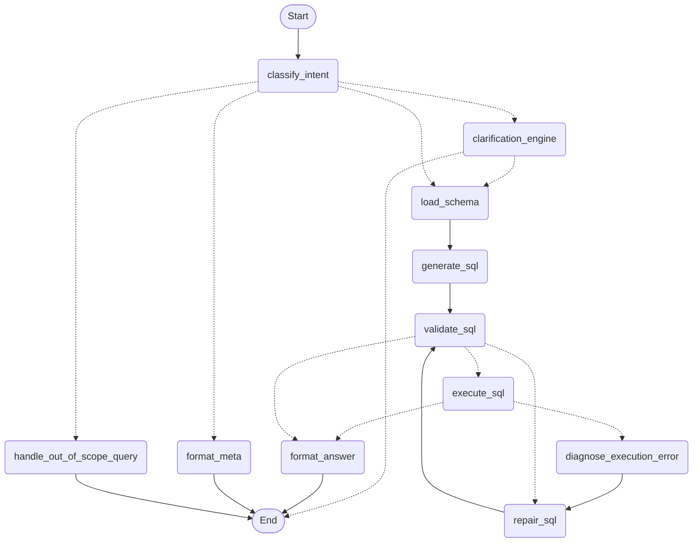

# text-to-sql

An intelligent Text-to-SQL agent that translates natural language into validated, executable SQL queries and converts the results into plain English.



<details>
<summary><strong>Installation & Local Setup</strong></summary>

### Prerequisites
- Python 3.13
- [`uv`](https://github.com/astral-sh/uv) package and project manager

### 1. Clone & Navigate
```bash
git clone https://github.com/k0msenapati/text-to-sql.git
cd text-to-sql
```

### 2. Configure Environment (Groq API Key)
Copy the example environment file:
```bash
cp .env.example .env
```
Open `.env` and add your [Groq API Key](https://console.groq.com/):
```env
GROQ_API_KEY=your_groq_api_key_here
```

### 3. Install Dependencies
Install dependencies and development tools using `uv`:
```bash
uv sync
```

### 4. Seed the Database
Initialize the SQLite database (`data/example.db`) with sample tables and records:
```bash
uv run python scripts/seed.py
```

</details>

<details>
<summary><strong>Running the Agent</strong></summary>

Start the interactive CLI session:

```bash
uv run python main.py
```

### Interactive Commands
- **Ask questions**: Enter any query in natural language:
  - *"List all customers who live in Canada."*
  - *"What are the top 3 most expensive products?"*
  - *"Which product has the highest number of 5-star reviews?"*
- **View Graph**: Type `graph` to view the LangGraph execution flow diagram in ASCII.
- **Quit**: Type `exit` or `quit` to terminate the session.

</details>

<details>
<summary><strong>Running Tests</strong></summary>

Execute the automated test suite with `pytest`:

```bash
uv run pytest
```

The test suite covers:
- Agent SQL generation and validation
- Syntax checking and self-repair loops
- Query execution accuracy and runtime error handling
- Result set comparator logic

</details>

<details>
<summary><strong>Running Evaluation Benchmarks</strong></summary>

Benchmark the agent's execution accuracy (EX) against precomputed ground-truth datasets:

```bash
uv run python scripts/evaluate.py
```

### Evaluation Options
- **Filter by difficulty**:
  ```bash
  uv run python scripts/evaluate.py --difficulty easy
  # Options: easy, medium, hard, challenge, all (default)
  ```
- **Run a specific test case**:
  ```bash
  uv run python scripts/evaluate.py --case EASY-01
  ```
- **Verbose mode** (displays generated SQL, expected SQL, and detailed row comparisons):
  ```bash
  uv run python scripts/evaluate.py -v
  ```
- **Custom report file**:
  ```bash
  uv run python scripts/evaluate.py --output eval_report.json
  ```

Benchmark statistics and error diagnostics are displayed in the terminal, and detailed results are saved to `eval_report.json`.

</details>
